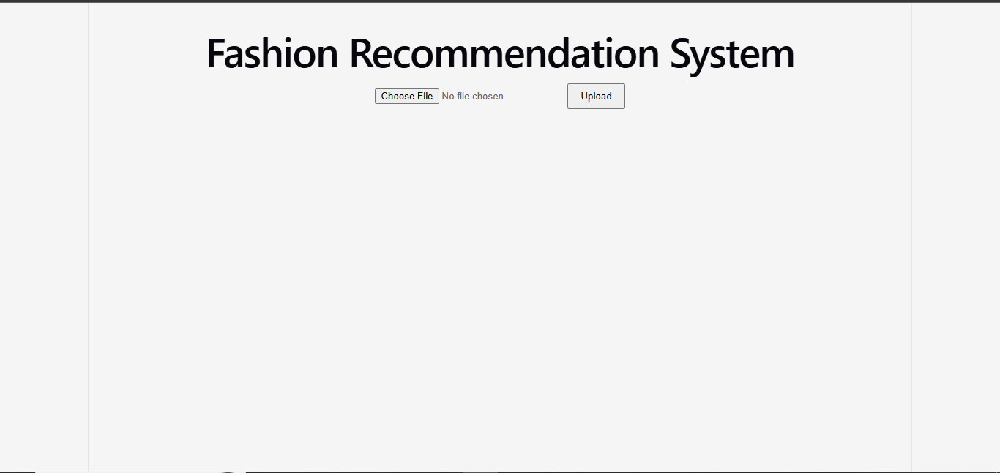
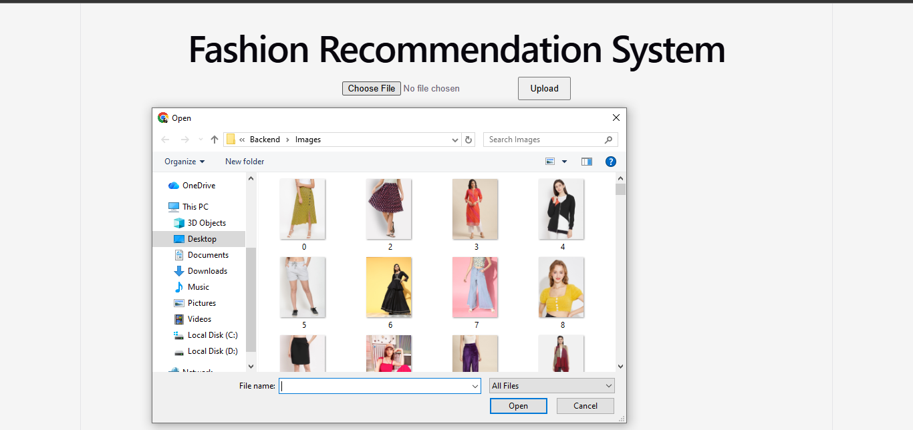
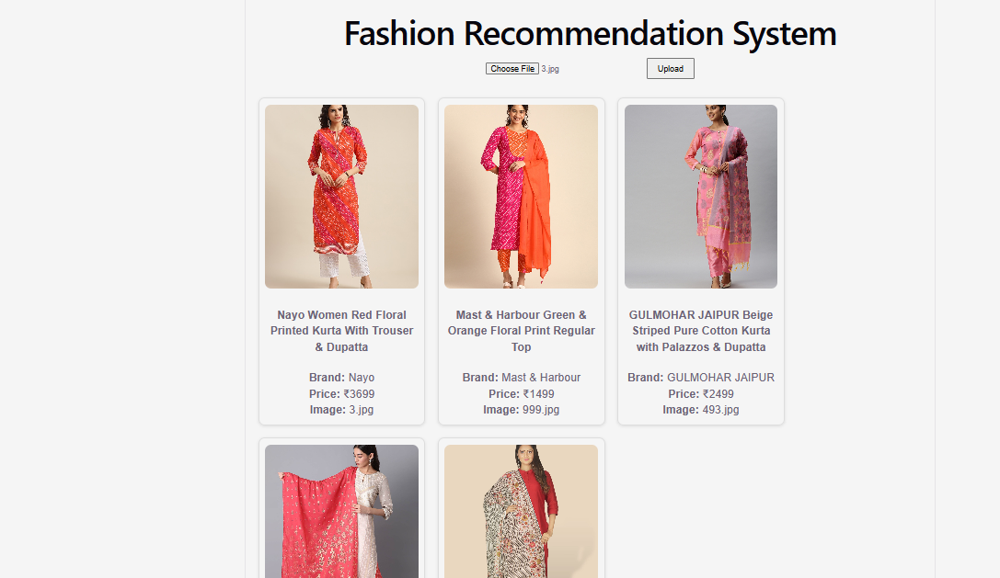
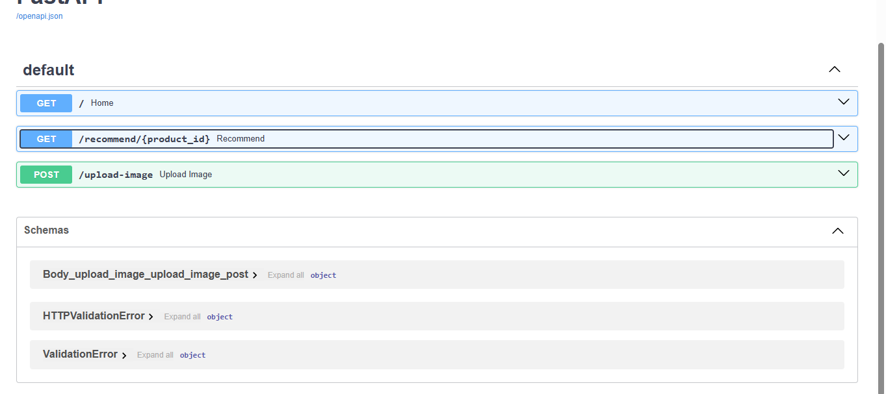

# 👗 AI-Powered Hybrid Fashion Recommendation System


An AI-powered fashion recommendation system that recommends visually and semantically similar fashion products using **CLIP image embeddings**, **Sentence Transformers**, and **FAISS vector search**.

Users can upload an image of a clothing item and instantly receive similar product recommendations through an interactive React web interface.

---

# ✨ Features

- 📸 Upload any fashion image
- 🧠 AI-powered visual similarity search
- 📝 Semantic understanding using product descriptions
- 🔀 Hybrid recommendation engine (Image + Text)
- ⚡ Real-time recommendations using FAISS
- 🌐 FastAPI REST backend
- 💻 React frontend
- 🖼️ Displays product image, name, brand and price

---

# 🏗️ System Architecture

```
                    User Uploads Image
                            │
                            ▼
                    React Frontend
                            │
                            ▼
                    FastAPI Backend
                            │
            ┌───────────────┴───────────────┐
            │                               │
            ▼                               ▼
     CLIP Image Encoder         MiniLM Text Encoder
            │                               │
            └───────────────┬───────────────┘
                            ▼
                   Hybrid Embedding Vector
                            │
                            ▼
                     FAISS Vector Search
                            │
                            ▼
              Top Similar Fashion Products
                            │
                            ▼
                Product Details + Images
```

---

# 🚀 Tech Stack

## Frontend

- React
- Axios
- CSS

## Backend

- FastAPI
- Uvicorn
- Python

## Machine Learning

- CLIP (ViT-B-32)
- Sentence Transformers (MiniLM-L6-v2)
- FAISS
- NumPy
- Pandas

---

# 📂 Project Structure

```
AI-Fashion-Recommendation-System
│
├── Backend
│   ├── app.py
│   ├── search_engine.py
│   ├── generate_embedding.py
│   ├── generate_text_embeddings.py
│   ├── build_index.py
│   ├── build_hybrid_index.py
│   ├── create_hybrid.py
│   ├── requirements.txt
│   ├── Images/
│   ├── uploads/
│   ├── *.npy
│   └── *.index
│
├── frontend
│   ├── src/
│   ├── public/
│   └── package.json
│
├── screenshots
│
├── Dockerfile
└── README.md
```

---

# ⚙️ How It Works

### Step 1

The uploaded image is encoded into a **512-dimensional CLIP embedding**.

### Step 2

Product descriptions are encoded into **384-dimensional MiniLM embeddings**.

### Step 3

Image and text embeddings are concatenated to form a **hybrid embedding**.

### Step 4

FAISS performs efficient nearest-neighbor search on the hybrid embedding space.

### Step 5

The system returns the most similar fashion products.

---

# 📊 Model Pipeline

```
Image
      │
      ▼
CLIP Encoder
      │
      ▼
Image Embedding (512)

Description
      │
      ▼
MiniLM Encoder
      │
      ▼
Text Embedding (384)

        │
        ▼

Hybrid Embedding (896)

        │
        ▼

FAISS Search

        │
        ▼

Recommendations
```

---

# 📸 Screenshots

## Home Page



---

## Upload Interface



---

## Recommendations



---

## FastAPI API



---

# ▶️ Installation

Clone the repository

```bash
git clone https://github.com/Meghna768/AI-Fashion-Recommendation-System.git
```

Backend

```bash
cd Backend

pip install -r requirements.txt

uvicorn app:app --reload
```

Frontend

```bash
cd frontend

npm install

npm run dev
```

---

# 💡 Future Improvements

- Personalized recommendations
- User authentication
- Wishlist functionality
- Cloud deployment
- Docker support
- PostgreSQL integration
- Collaborative filtering
- LLM-powered fashion assistant

---

# 📚 Dataset

Fashion product dataset containing product images, metadata, prices and descriptions.

---

# 🙋 Author

**Meghna Menon**

Computer Science Student | Machine Learning | AI | Data Science

GitHub: https://github.com/Meghna768
